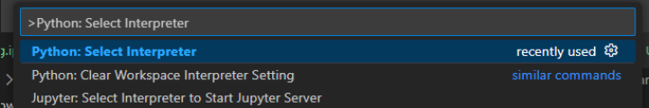
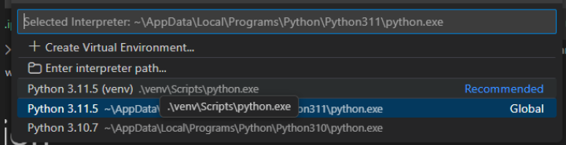

# Predictive maintenance AI
## Structure du code
Nous avons plusieurs dossiers qui ont des rôles différents:
- data: stocke les données des différentes étapes du projet.
- models: c'est la sortie des models de machine learning
- notebooks: contient un notebook pour chaque partie + un notebook principale qui regroupe tout avec un contenu simplifié
- src: contient tout le code qui sera utilisé dans le jupiter notebook

## Configuration
### 1. Création de l'environnement python
Avant de commencer le projet, il faut commencer par creer l'environnement python. C'est dedans que l'on va installer les dépendances afin de bien isoler les librairies python de ce projet des librairies installées sur notre pc. Après avoir créé l'environnement, il faudra l'activer:

```bash
python -m venv venv
venv\Scripts\activate
```

Ensuite, il faut sélectionner cette environement dans l'interprete python. Pour ce faire, aller dans la barre de recherche VS code, et rechercher `>Python: Select Interpreter`



Ensuite sélectionner `(venv)`



## 2. Installation des dépendances
Toutes les dépendances sont placées dans un fichier `requirement.txt`. Pour installer toutes ces dépendances, il faut d'abord mettre le pip à jour, et ensuite lancer la commande d'installation:

```bash
python -m pip install --upgrade pip
pip install -r requirements.txt
```

## 3. Rendre le code source accessible dans tout le projet
Actuellement, si dans le notebooks on essaye d'importer les méthodes créés dans le dossier `src`, on ne pourra pas le faire directement à cause des limitations du Python. Pour passer outre ce problème, on place un petit code dans le notebook. Il permet de remonter dans le dossier parent afin

```python
import sys, os
sys.path.append(os.path.abspath('..'))
```
Ensuite on peux accéder au code source:

```python
import sys, os
sys.path.append(os.path.abspath('..'))
import src.step_01_fusion_alignement.fusion_alignment as fusion_alignment

data_stable = fusion_alignment.get_files("PI-donnee-saine")
```

## Éviter le problème du code source non à jour
Il est possible que quand l'on modifie le code dans src, que le notebook ne garde pas la dernière version, alors il faut soit redémarrer le kernel notebook, ou ajouter un code qui force le rechargement du code:

```python
import importlib
import src.step_01_fusion_alignement.fusion_alignment as fusion_alignment

importlib.reload(fusion_alignment)
```