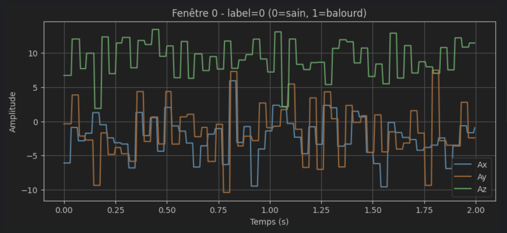
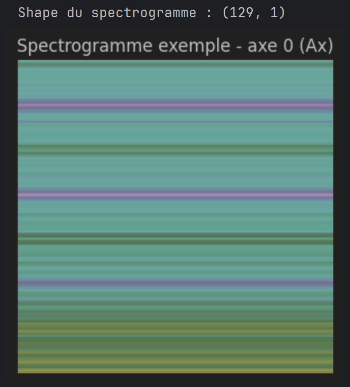

# Étape 03 – Génération des spectrogrammes (STFT)

## Entrées
- `data/03_windowed/X_windows.npy`
- `data/03_windowed/y_labels.npy`

Ces fichiers sont générés par l’étape 02 (fenêtrage + étiquetage).

---

## Ce que fait l’étape 03
- applique la **STFT** sur chaque fenêtre de signaux  
- génère **un spectrogramme par axe** (Ax, Ay, Az) → **3 images par fenêtre**
- convertit les matrices STFT en **images PNG**
- classe les images selon le label :
  - `sain`
  - `balourd`
- prépare toutes les images pour l’entraînement du CNN (Étape 04)

---

## En détail

Pour cette étape, je transforme les séries temporelles fenêtrées (issues de `X_windows.npy`) en **spectrogrammes STFT** exploitables comme images par le modèle de deep learning.

On part de :

data/03_windowed/X_windows.npy
data/03_windowed/y_labels.npy

Chaque fenêtre contient **400 échantillons × 6 canaux** :  
Ax, Ay, Az, Gx, Gy, Gz.

### Exemple de fenêtre temporelle (2 secondes)

---

## 🔍 Calcul de la STFT

Pour chaque axe, j’applique la **Short-Time Fourier Transform** avec :

- `fs = 200 Hz` (fréquence d’échantillonnage estimée automatiquement)
- `n_fft = 256`
- `noverlap = 0` (aucun recouvrement → essentiel pour isoler les fréquences du balourd)
- magnitude du spectre uniquement (pas la phase)

Chaque axe génère une matrice spectrogramme de taille :  
`(129 fréquences, 1 time_bin)`

Ce format montre la distribution des fréquences analysées sur la fenêtre complète de 2 secondes.

---

## 🖼 Transformation en images PNG

Après la STFT :

1. j’applique une **normalisation log-amplitude**
2. je convertis chaque spectrogramme en **PNG**
3. je range les images dans les bons dossiers :

data/04_spectrograms/sain/
data/04_spectrograms/balourd/

Chaque fenêtre génère **3 images** (Ax, Ay, Az).

### Exemple de spectrogramme STFT (axe Ax)

---

## 📊 Résultats finaux

- 551 fenêtres **saines** → **1653 images**
- 246 fenêtres **balourd** → **738 images**
- **2391 spectrogrammes** au total

---

## 📁 Structure générée

data/04_spectrograms/
├── sain/
│ ├── window_000_Ax.png
│ ├── window_000_Ay.png
│ └── window_000_Az.png
└── balourd/
├── window_551_Ax.png
├── window_551_Ay.png
└── window_551_Az.png
